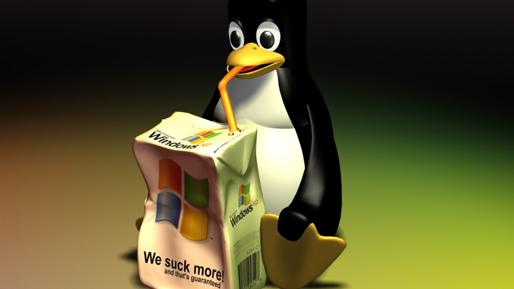

# Why Linux is better than Windows ?



## 1. Security
```
“Being secure by nature would make things easier for you and save money as well.” 
```
* Windows is a big target for viruses and malware. To deal with this issue, you must install an anti-virus application and firewall software which eats into your memory and CPU usage and this will also cost you a lot of money because you should get a premium Anti-virus software. 
* Linux does not require the use of such Anti-Virus programs. Of course, a couple of software tools still exist to help you, but it is often unnecessary when you have a Linux system. The way that Linux handles permissions and package management make Linux to be more secure than Windows.

## 2. Software Updates
```
“Updates shouldn't be forced on you or you should, at least, get a notice.”
```
* Windows is so annoying because it pushes a software update and chooses when to make updates. Also Windows often needs to be rebooted to install updates. It should be up to you when to install updates.
* With Linux, Users have full control when an update is made. Installation takes less time and no reboot is required.

## 3. Variety Of Distributions
```
“Variety is the soul of pleasure.”  ― Aphra Behn
```
* Windows has maintained a fairly standard version structure, with updates and versions.
* Linux has a lot of flavors. You will find tons of Linux distributions created for a different set of needs. Distros have a variety with tools, appearance and more other things.

## 4. Support
```
“We can't help everyone, but everyone can help someone.”  ― Ronald Reagan
```
* Microsoft has a lot of documentation, but when you get stuck, you may need to search their forums and other people may have asked a question that has no good answers. In many cases the support is coming from only employees, so there's a bad and slow support.
* Linux support is easier to find and there are dozens of forums and even more websites dedicated to helping people learn and understand Linux. You get support and answers from enthusiasts. 

## 5. Free and Open Source
```
“Let me be clear - Microsoft has no beef with open source.”  ― Craig Mundie
```
* To install Windows you have to pay a lot of money or get a cracked version that may get viruses to your PC and make your device so slow. 
* Linux is completely an open source project, you can have a look at the [source code](https://github.com/torvalds/linux). Linux has all the features you need in an operating system and they're fully free. 

