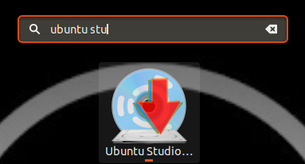
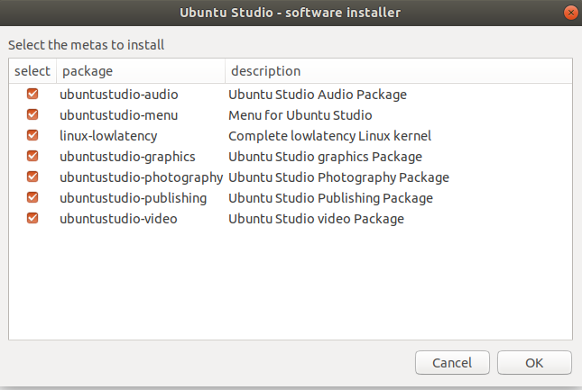

# Ubuntu-Studio

- REVIEW BY : [Thoraya Khaled](https://github.com/thoraiia)

## Video based version of the review <b> in arabic </b> on youtube:

[Arabic Review Video](https://bit.ly/3nQvwQM)

## What is Ubuntu-Studio?

Ubuntu Studio is a free and open source operating system, and an official flavor of Ubuntu. Ubuntu Studio is the most widely used multimedia-orientated operating system in the world. It comes preinstalled with a selection of the most common free multimedia applications available, and is configured for best performance for various purposes: Audio, Graphics, Video, Photography and Publishing.

## System Requirements:

* Required ( 2 GB Ram - 16 GB Storage )
* Recommended ( 8 GB Ram - 64 GB for audio/video work )

## Desktop Environment

* Up until version 20.10 Ubuntu Studio shipped with the Xfce desktop environment, but this was replaced by KDE Plasma in October 2020.
* personally I use the gnome DE, in both cases you may need sometime to get used to it, especially if you're a windows user

## Supported Features 💪💪

1. **Audio** (Recording, mixing, mastering, live processing, or even coding) e.g:Audacity
2. **Graphics** (Provide many graphic design and modeling applications) e.g: Blender, Inkscape, GIMP, PikoPixel
3. **Publishing** (Achieve professional results for publishing books) e.g: Calibre, Scribus, LibreOffice
4. **Photography** (Edit, process and organize your photos)
5. **Video** ( 3D modeling, animation, compositing, and more ) e.g: Openshot

## Installation On Ubuntu

1. get the Ubuntu Studio Installer

``` bash
sudo apt install ubuntustudio-installer
```

2. open the installer



3. select the packages you want to install



## Visitors Rating on Distrowatch

8.22/10